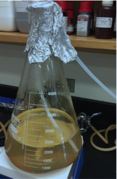
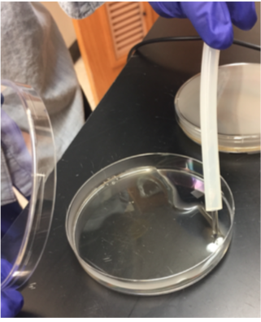
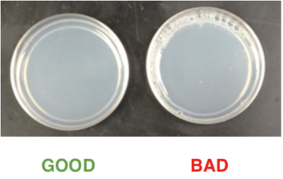
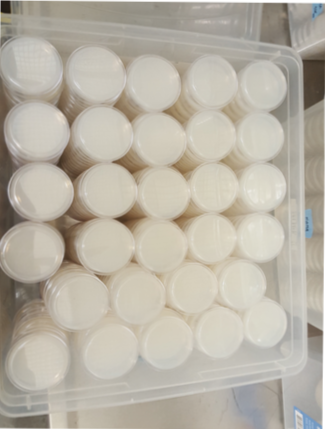
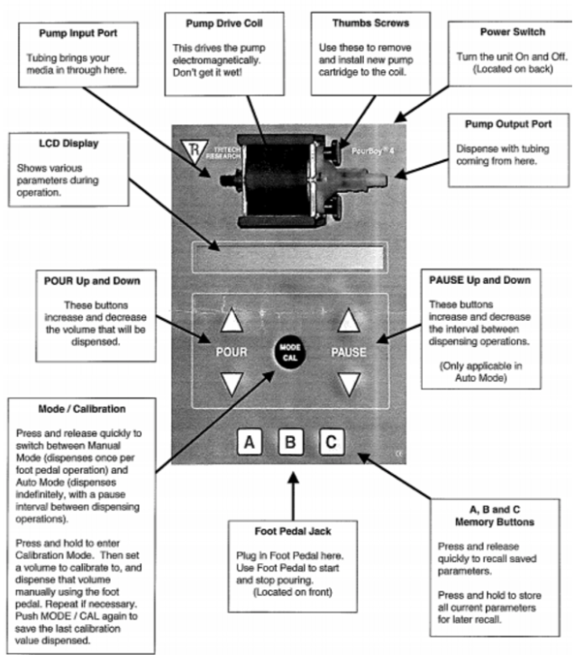

# NGM Plate Pouring Protocol

## General notes:

  - 6 cm plates take 13.5 mL of solution

  - 10 cm plates take 32.5 mL of solution

## Protocol  

1. Prepare media using the following recipe:

    **Note:** The dry ingredients for the media can be pre-measured into the plastic bottles labeled "For NGM Prep" (Shelf 2). Label the bottle with a piece of tape stating: The type of media and final volume (e.g. NGM-1 L) or NGM-2 L), date of preparation, and your initials.

    NGM recipe:

    | Reagent | 1 L | 2 L |
    | ------- | --- | --- |
    | Peptone | 2.5g | 5 g |
    | NaCl | 3 g | 6 g |
    | Agar | 17 g | 34 g |
    | Sterile water | 975 mL | 1950 mL |

    - Note: if pouring NGMA plates, add 7 g of Agarose and 10 g of Agar per 1 L of media.

2. Combine all reagents in a flask that can hold 2X the volume of your media.

      a. Put a plastic funnel in the mouth of the flask.

      b. Dump the contents of the bottle into the flask.

      c. Pour sterile water into the bottle and swirl to get any powder reagents off the sides.

      d. Pour the water from the bottle into the flask, making sure to rinse any powder stuck on the funnel into the flask.

      e. Repeat steps c and d until you've poured in all the sterile water.

3. Cover the mouth of the flask with foil and tape in place with autoclave tape (autoclave room). Use label tape to label the flask with: media (e.g. NGM or HGM), date of pour, and your initials. **NOTE:** you can simply move the tape label from the plastic bottle to the flask, making sure to also write the date of pour on the label.

4. Add stir bar.

5. Autoclave the following with a 60 min. liquid cycle:

    a. 500 mL H2O in a 500 mL bottle.

    b. Liquid dispenser hoses capped and wrapped with aluminum foil.

    c. NMG or HGM media.

6. Turn on the water baths in lab room 230 and set temperature to 55°C while the media is still in the autoclave. Once sterilization of media is complete, bring the flask to the lab and allow it to cool to 55°C in the water bath for at least an hour (maximum of four hr.) and then add the following to the media **in the exact order listed**. Gently swirl to mix after addition of each reagent.

    | Reagent | 1 L | 2 L |
    | ------- | --- | --- |
    | 1 M KH2PO4 (K Phosphate Buffer) | 25 mL | 50 mL |
    | Cholesterol (5 mg/mL in Ethanol) | 1 mL | 2 mL |
    | 1 M CaCl2 | 1 mL | 2 mL |
    | 1 M MgSO4 | 1 mL | 2 mL |

If these solutions are already made, make sure they are autoclaved (except Cholesterol) or filter-sterilized before adding to the media.

**Number of plates poured per volume of NGM:**

 | 1 L of NGM | 2 L of NGM |
 | ---------- | ---------- |
 | ~60 6 cm plates | ~160 6 cm plates |
 | ~40 10 cm plates | ~60 10 cm plates |

## Operating the PourBoy

1. Things you will need to autoclave before PourBoy use:

  - PourBoy input and output tube: wrap the tube openings with foil, then fold the tubes up and wrap both tubes together in foil. Place autoclave tape on the wrapping.

  - 1 L sterile water (for cleaning of the PourBoy prior to use)

2. Once autoclaved, remove foil from one end of one of the tubes (tube 1) and connect that end to the input port (refer figure), then remove foil from one end of the other tube (tube 2) and connect that end to the output port.

3. Run 200 mL of hydrogen peroxide through the PourBoy.

4. Check PourBoy settings. Use the "POUR" up and down buttons to set the volume that must be dispensed into each plate Press and release the "MODE/CAL" button to switch between Manual mode (dispenses once per foot pedal operation) and Auto mode (dispenses indefinitely, with a pause interval between dispensing operations). Use the "PAUSE" up and down buttons to increase and decrease the interval between dispensing operations in auto mode. Foot pedal is hard-wired to the PourBoy pump and you should not attempt to remove it.

    **NOTE: Be very careful with the ends of the tubes from this point forward. They are sterile and must be kept sterile while pouring plates. Do not allow them to touch anything but the inside of the autoclaved media, water, or aluminum foil.**

5. Place the autoclaved bottle of water on the hot plate (setting 4/5).

6. Remove the foil from the other end of tube 1 and lower the tube into autoclaved water (<100°C). Remove foil from the other end of tube 2 and hold over a plastic jug to collect dispensed water. Ensure that the tube does not touch the sides of the non-sterile jug. Use the foot petal to pass water through the tubes to sterilize the pump drive coil. Use a plastic receptacle (Shelf 5) as a waste container for water/media.

7. Once you've passed ~300-400 mL of water, switch tube 1 to the flask with media (bring to room 223 from the water bath in room 230), kept on the hot plate. Once the tube is in the flask, cover the mouth of the flask with foil. Bring the water to the water bath.

    

8. Wipe down the working area with 70% ethanol and then spread individual plates out on the table.

    

9. While holding the lid of a plate open, move the dispensing end of tube 2 over the plate and use the foot pedal to dispense the set volume of media. Then move on to the next plate. **Be sure not to touch the tip of the tubing onto any part of the plate.**

    

10. Throughout the plate pouring procedure, remember to watch the flask to ensure that the media is getting into the tubing even when there is only a small volume of media left in the flask. If the opening of the tubing is not completely covered by media,  air will get into the tubing, which results in bubbles in the plates. **Plates with bubbles are not usable.** Tip the flask to the side to pour out the last few plates. Stop the pouring if there is not enough media left (less than the volume for one plate).

    

11. Once the desired number of plates have been poured, switch tube 1 from the flask with 200 mL of hydrogen peroxide and run entire volume through. Then, switch to the bottle with hot water (switch the water with the media flask on the hot plate to heat up the water) and foot pedal 300-400 mL of water through the PourBoy to flush out media before it solidifies in the tubes and pump drive coil.

12. Once all plates are **solidified** (~15 min. for 6 cm plates and ~30 min. for 10 cm plates) stack them up (**lid-side up**) and use labelling tape to label them with the name of media, name of the person that poured the plates, time, and date.

    

13. Leave plates stacked on benchtop for two days. Place in a clean a plastic box wiped down with 70% ethanol (wipe down all sides of the box until dry). Then stack the poured plates in the box, **lid-side down**. Transfer the labelling tape form step 9 to the box.

14. Store the box in the 4°C deli-style fridge.

  **NOTE:** When pouring many plates, there is not enough room on the bench to fit all of the plates in the media. To maximize space, you can stack 3-4 plates on top of each other and pour from the bottom up of each stack. When done with a stack, place the flask of media back in the 60°C water bath, and wait for the plates to dry (20-30 min.). Once dry, stack all of the plates on the right end of the bench and place out more stacks of plates to pour. Continue and repeat until all of the media has been poured.

  | Plate Storage |
  | ------------- |
  | ~240 6 cm plates fit in one large plastic box |
  | ~70-80 plates fit in one large plastic box |

  

## Pourboy Configuration

  
