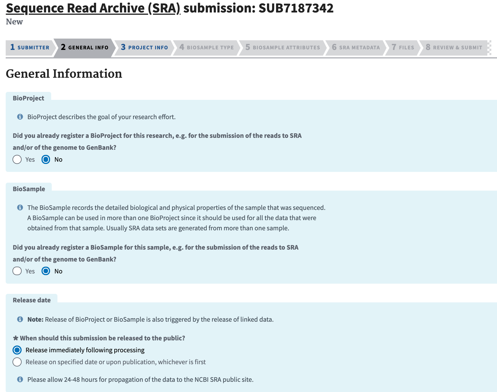
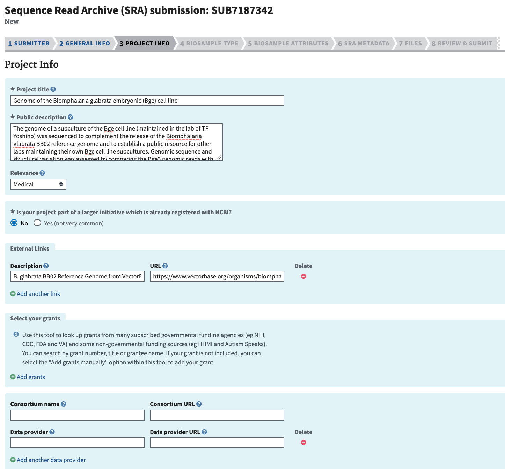
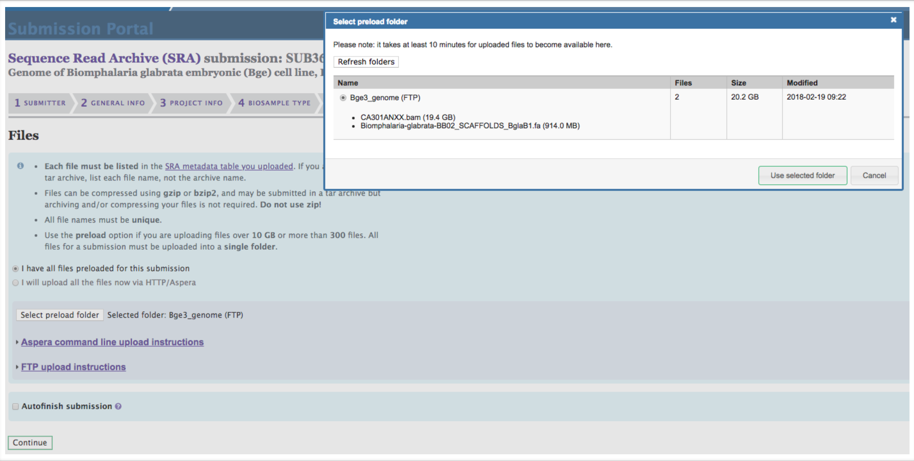

# Date Upload to NCBI

1. Prepare files for data upload.

    a. Ensure proper and informative nomenclature.

    b. Compress files with gzip.

2. Navigate to the SRA [submission portal](https://submit.ncbi.nlm.nih.gov/subs/sra/).

    a. Login or sign-up for an NCBI account.

3. If the total size of the files to be uploaded exceeds 10 GB, click FTP Upload under Options to preload data:

    a. Follow the instructions to preload via command line FTP.

    b. Use LFTP (if not installed, install via brew install lftp) from either the BRC server or your local machine. For instance:

        lftp subftp@ftp-private.ncbi.nlm.nih.gov

        # enter given passcode.

        cd uploads/nicolas.j.wheeler@gmail.com_yFoD9mjy

        mkdir Bge3_genome

        cd Bge3_genome

        put /home/BIOTECH/zamanian/GHdata/BgeVars/Bge/CA301ANXX.bam

4. Once the preload is complete, click “New submission” on the SRA wizard home page.

5. Complete the Submitter section and click “Continue.”

6. Complete the General Info section and click “Continue.” Unless you are updating previous data, you will probably need to select "No" for both the BioProject and BioSample panes. For “Projected release data,” choose a date 10-12 months out if the manuscript is in process of being written. Adjust accordingly based on the current stage of writing.

7. Complete the Project Info section and click “Continue.” Include a short but descriptive “Public Description” that will complement the abstract of the ensuing manuscript. If reference data came from a database external to NCBI, include the link in “External Links.”

8. Complete the BioSample Type section. Consult previous BioSamples for guidance. For example, previously deposited *Biomphalaria glabrata* samples have been designated as “Model organism or animal” (red arrow). To the best of your ability, attempt to maintain consistency with deposited samples from similar sources.

9. In the BioSample Attributes section, download the provided Excel file and complete it. To save, click File > Save As... and choose File Format: Tab delimited Text (.txt).

10. In the BioSample Attributes section, click “Choose File” and select the previously saved .txt file. Click “Continue” after the file finishes uploading.

11. Complete the SRA Metadata section. The filenames should match the preloaded filenames.

12. Complete the Files section. Click “I have all files preloaded for this submission.” Click “Select preload folder.” If you have followed these instructions correctly, the files that you preloaded should appear in the box that appears, and these files should match the filenames that you entered in the SRA Metadata selection. Select the proper folder.

13. Ensure everything has been input properly in the Overview section. When satisfied, click finish. You will receive confirmation emails shortly that provide the BioProject and BioSample accession numbers.
