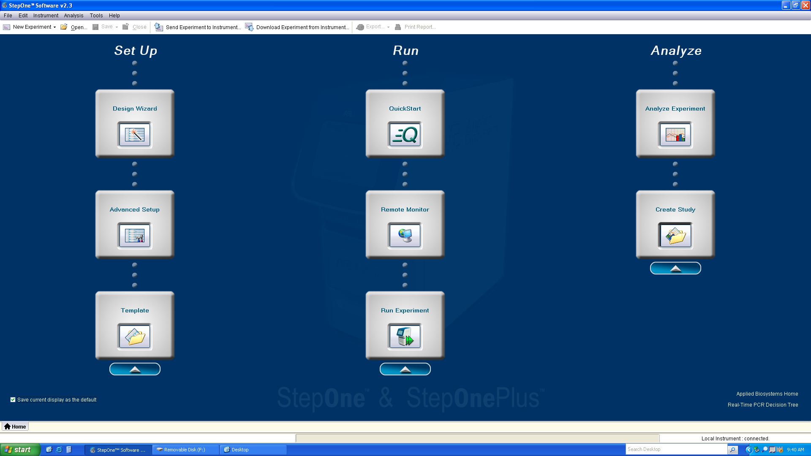
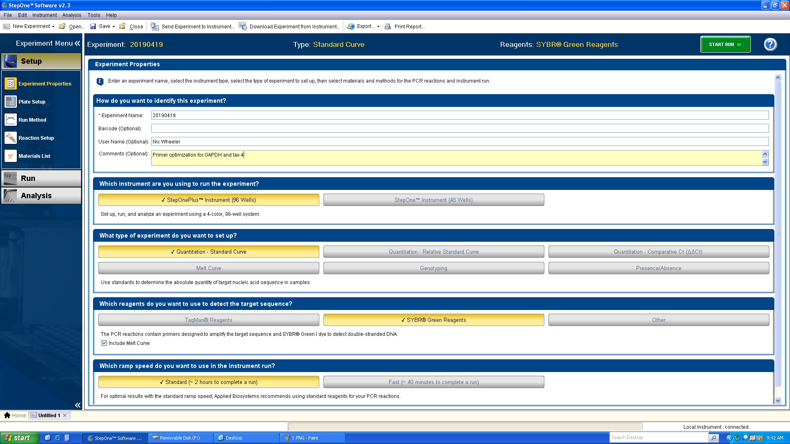
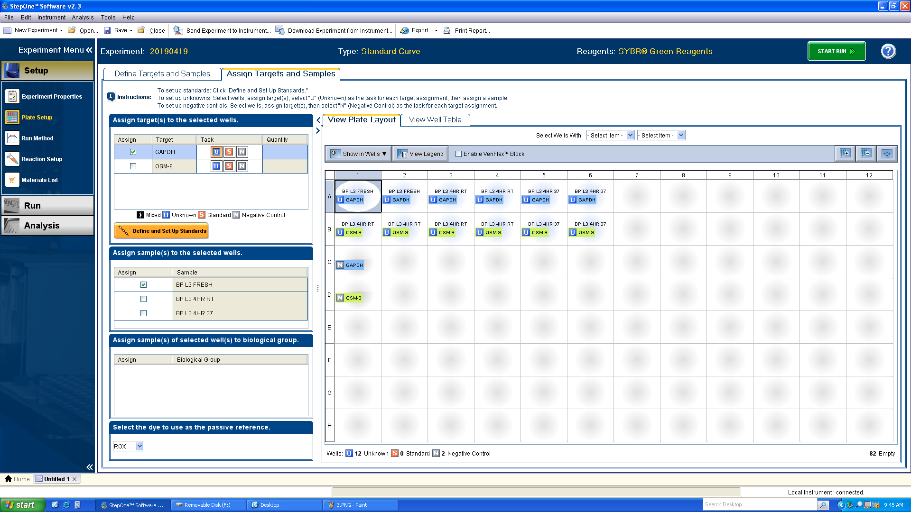
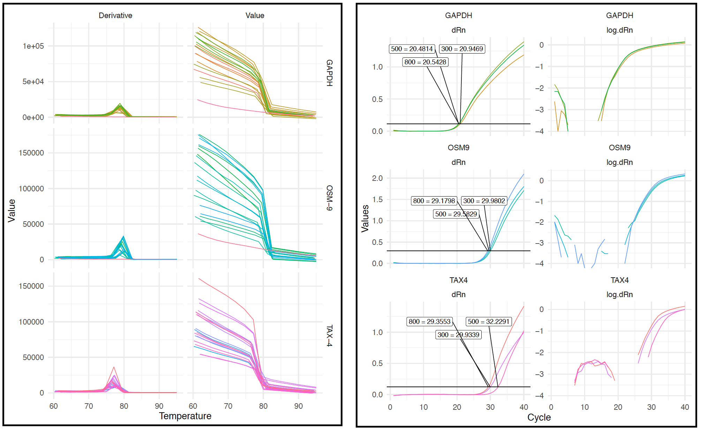

# Two-Step qPCR

## Materials

- Direct-zol RNA Miniprep Plus (Zymo Research R2070S)
- SuperScript III (Thermo Fisher Scientific 18080051)
- PowerUp SYBR Green MasterMix (Fisher Scientific A25741)
- qPCR sub-skirted plate (MIDSCI AVT3890)
- Thermal sealing film (Excel Scientific TS-RT2RR-100)

## Preparation

- Two-step qPCR starts with RNA that has been DNase-treated and quantified with NanoDrop. Follow the the RNA extraction protocol for [*C. elegans*](../../Caenorhabditis_elegans/RNA_Extraction/RNA_Extraction.md) or [parasites](../../Parasitic_Nematodes/Parasite_RNA_Extraction/Parasite_RNA_Extraction.md).

- Use the Invitrogen SuperScript III kit to perform first-strand cDNA synthesis.

    - Do not freeze RNA in between extraction and first-strand synthesis; perform synthesis immediately after quantification.

    - Include a non-experimental RNA sample that comes from the same species and stage as your experimental samples (I typically use stock RNA samples from the FR3).

    - If performing relative transcript quantification, be sure to normalize the RNA input based on the Qubit quantification.

    - Use a 1:1 mixture of oligo(dT) and random hexamer primers and create primer and enzyme master mixes to use across all samples.

    - Perform the optional RNase H digestion to remove remaining single-stranded RNAs.

    - Freeze at -20°C until ready for the qPCR.

- Before optimizing your primers, validate that they work and produce the expected amplicon length by performing normal PCR on a plasmid template and/or cDNA template.

- Book the qPCR machine (room 311) on the morning of the reaction.

## Primer optimization

### Primer stock dilutions

- qPCR primers must be optimized for each new RNA/cDNA template.

- Primer optimization involves primer dilutions to find the optimal primer concentration for each primer set + template combination.

- Depending on your experiments, you should probably use the **same stage, non-experimental** cDNA sample that is at the **same concentration** as your experimental samples (the best practice is to include this sample in your cDNA synthesis reaction).

- The PowerUp SYBR Green Master Mix kit recommends trying 300, 500, and 800 nM final concentrations, but you can add additional (lower) concentrations as well.

1. Use the table below to calculate qPCR primer stock concentrations:

| Cf (qPCR primers, nM) | Vfi (Primer + Water Input) | Ci (Primer Input) |
|----------------------------------|------------------------------|--------------------------------------|------------------------------|
| 300                              | 20                           | **8** = 20 μL - 10 μL MM - 2 μL cDNA | = A1 * B1 / C1 = 750         |
| 500                              | 20                           | **8** = 20 μL - 10 μL MM - 2 μL cDNA | = A2 * B2 / C2 = 1250        |
| 800                              | 20                           | **8** = 20 μL - 10 μL MM - 2 μL cDNA | = A3 * B3 / C3 = 2000        |

**NOTE: volumes in D are calculated using a cDNA input of 2 μL and will need to be adjust for different inputs.**

2. Use a separate freezer box for qPCR primer and make a new 10 μM working stock that contains both the forward and the reverse primer.

    a. Add 20 μL of each primer and 160 μL water.

3. Use the table below to calculate the dilutions for qPCR primer stocks. Add the appropriate volume of 10 μM working stock to water for a final volume of 50 μL.

| Cf (qPCR primer stock, nM) | Vfi (Primer Stock) | Vi (Primer Stock Input) |
|---------------------------------------|----------------------------------|------------------------------|------------------------------------|
| 750                                   | 50                               | 10                           | = A1 / 1000 * B1 / C1 = 3.75       |
| 1250                                  | 50                               | 10                           | = A2 / 1000 * B2 / C2 = 6.25       |
| 2000                                  | 50                               | 10                           | = A3 / 1000 * B3 / C3 = 10         |

### Plate setup

- Each qPCR experiment should contain a minimum of 5 ng RNA/cDNA (10 ng is preferable).

- If possible, each primer dilution should be run in duplicate.

- Use a non-experimental cDNA sample that has the same concentration and is from the same life stage as your experimental samples.

1. Design the plate setup on Benchling (example below).

    a. If possible, do not add any reactions to the outer columns or rows to ensure no evaporation (though I have not run into evaporation problems regardless of well location).

    b. Keep the same primers next to each other on the plate.

    c. Be sure to include no-template negative controls to check for contamination in your primer stocks.

    

2. Dilute an aliquot of the cDNA to 2.5 ng μL so that 2 μL input cDNA will make 5ng/qPCR (or dilute to half of the final mass so that you can add 2 μL to the reaction).

3. Create primer + PowerUp SYBR Green master mixes by adding 10 μL PowerUp SYBR Green * (n + 1) + 8 μL primer dilution * (n + 1) to a single tube (one master mix per primer dilution).

4. Put a qPCR plate on ice.

5. Pipette 2 μL of the proper cDNA to the **side wall** of the well.

    a. This makes it easier to keep track of which well has had the cDNA added.

    b. Another strategy for keeping track of pipetting is arranging your pipette tip box such that you know exactly which tip will be the last one to be used.

6. Add 18 μL of the proper master mix to the dot of cDNA and allows the mixture to fall to the bottom of the tube.

7. Carefully seal the plate with sealing film.

8. Spin the plate on the plate centrifuge.

9. Examine the bottom of each well to ensure no bubbles remain. If there are bubbles, sharply flick the well until it pops. Respin the plate if necessary.

10. Return the plate to ice and move to the qPCR machine in room 311.

### Thermocycler setup

1. Touch the screen of the thermocycler to wake it up and press the on/off button to turn it on.

2. Place the qPCR plate in the machine.

3. Begin the StepOne v2.3 program and login as a guest.

4. Click “Advanced Setup, which will open the following screen.

5. Fill out the metadata and match the selections shown above.

    a. Experiment name should be the date of the run.

    b. Add your full name as the user name.

    c. Add optional comments, especially if you’re performing multiple runs on a single day.

    d. Choose the StepOnePlus instrument.

    e. Choose Quantitation - Standard Curve (you can perform the ΔΔCT calculation later).

    f. Choose SYBR Green.

    g. Choose Standard.

6. Click the “Plate Setup” menu (orange arrow).

  a. In the “Define Targets and Samples” tab, add your targets and samples to the appropriate panes. For primer optimization runs, the “Sample Names” should be the different primer dilutions (i.e. 300, 500, and 800).

  b. Ignore the “Biological Replicates” pane even if you have biological replicates.

7. Click the “Assign Targets and Samples” tab.

    a. Design the plate in the same arrangement as designed on Benchling. Select a well or range of well and click the boxes next to the proper target and sample.

    b. Note: each experimental sample should also include the “U” task next to the target name. Before defining no-template negative controls in the plate layout (in this case, wells C1 and D1), click the “N” box in the Task section.

    

8. Click the “Run Method” menu.

    a. Setup the thermocycler program according to the below screenshot. Changes that need to be made from the default program:

      i. A 2 minute, 50°C hold step needs to be added before the 95° hold step in the Holding Stage.

      ii. The 95° hold step should be changed to 2 minutes.

      iii. Based on your primers, you probably need to add a 3rd step to the Cycling Stage. Adjust the 2nd step to 15 seconds and the annealing temperature validated with the initial PCR used to test the primers on plasmid/cDNA template. Add a 3rd step with a 1 minute, 72°C  extension. Deselect the “Data Collection” icon on the annealing step and select it on the extension step.

      iv. Change the Melt Curve Stage from “Step and Hold” to “Continuous.”

      v. Change the percentage of the ramp rate to 10%.

    

9. When finished setting up the run, click “Start Run” (green button).

10. Stay in the room until you confirm that the run has started.

### Primer optimization analysis

1. After the run is complete, click the Analysis menu.

    a. You can quickly analyze the run in the StepOne program, but the lab also has an R script that allows for more customized analysis.

2. On the thermocycler computer, click Export

    a. Chose all data files other than Multicomponent Data.

    b. Export to a .txt file type.

    c. Export to an external flash drive.

3. Transfer the .txt file to `ZamanianLab/Data/qPCR/Name/Date/` and copy the `primer_optimization.R` script to the directory.

4. Once transferred, open the .txt file and manually edit it such that each section defined in [square brackets] is saved into its own file. When naming the files, add the date to the beginning of each file name, followed by an underscore. You should have the following files (file names should be the exact same, otherwise the analysis script won’t work.) Make sure the [words in brackets] are removed from the files so that every line is tab-delimited.

    a. `YEARMTDY_results.txt`

    b. `YEARMTDY_melt_region_derivative_data.txt`

    c. `YEARMTDY_melt_region_normalized_data.txt`

    d. `YEARMTDY_melt_region_temperature_data.txt`

    e. `YEARMTDY_amplification_data.txt`

    f. `YEARMTDY_raw_data.txt`

    g. `YEARMTDY_sample_setup.txt`

    h. For instance, the header of each file should look something like this:

    

5. Open RStudio.

    a. Navigate to File > New Project...

    b. Click Existing Directory.

    c. Click Browse...

    d. Navigate to the directory containing your qPCR data and click Open.

    e. Close RStudio.

6. Open up your Terminal application.

    a. Navigate to your directory by amending the {name} and {date} sections of the command `cd ZamanianLab/Data/qPCR/{Name}/{Date}/`

    b. Run the command `Rscript primer_optimzation.R {Date}`

    c. The script should produce two PDFs, `amplification.pdf` and `melt_curves.pdf` and it should print out the best primer concnetration for each sample.

7. Examine the plot in `melt_curves.pdf` (left).

    a. The plot should contain 2 columns labeled Derivative and Value; these show the changes in fluorescence emitted at different temperatures during the melting of the last step of the Melt Curve stage.

    b. The plot should also contain a row for every target (i.e., primer set), and each panel should include a line for every well.

    c. Analysis of the melt curves will tell you if your primers are forming primer dimers or are amplifying off-target sequences. In order to continue with the qPCR experiment, your primer should include a single peak in the Derivative plot, corresponding to a single amplicon produced by the reaction. Primer dimers will correspond to peaks at low temperatures, and longer non-off target products will correspond to peaks at higher temperatures.

    d. Negative controls will not have a peak (because there should be no amplification). You will notice from the above plot that the negative controls for GAPDH and OSM-9 were correct, while it appears that there was contamination in the TAX-4 primers (every line contains a peak).

    

8. Examine the plot in `amplification.pdf` (right).

    a. Again there will be a row for every target and a column for dRn and log10(dRn)

    b. In the dRn column, you should see a label and line marking each of the primer dilutions you included, along with the CT value. The dilution with the lowest CT, in this case 800 for all primer sets, should be used in qPCR using experimental samples.

## qPCR with experimental samples

1. Based on the results of the primer optimization, create new primer dilutions at the optimized concentrations, this time ensuring you make enough of the qPCR primer stock for all of the reactions (use the tables above).

2. Follow the **Plate setup** and **Thermocycler setup** sections above.

    a. When organizing the plate in **Thermocycler setup** step 6, use your different cDNAs instead of primer dilutions as the Sample Names.

    b. Run the exact same thermocyler program as you ran for primer optimization.

### qPCR analysis

1. Follow steps 1 - 4 from **Primer optimization analysis** to export the reaction results
as described.

2. Transfer `qpcr_analysis.R` to the folder containing the data.

3. Open `qpcr_analysis.R` in RStudio.

4. Run lines 1 - 95 to create `amplification.pdf` and `melt_curves.pdf`.

5. Examine the resulting images to check for on-target amplification and proper results for the negative controls.

6. Run lines 100 - 127 to plot the CT values for each sample (using the mean from technical replicates).

7. If performing ΔΔCT calculations, you will have to manually edit lines 132 - 183.
