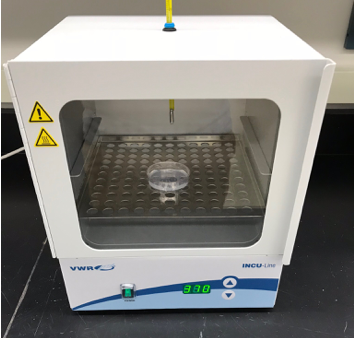

# L3 Filarial Parasite Chemotaxis Assay

## Materials

- Agarose (Molecular Grade)
- 6 cm Petri Dishes

## Preparing Chemotaxis Plates

**Note:** Make chemotaxis plates at least 48 hours in advance of assay. Humidity plays a significant role in plate optimization for this assay.

- Make 0.8% (w/v) agarose plates. Microwave to dissolve (mix intermittently). Pour ~10 mL of agarose into each 6 cm plate. Leave plates at room temperature with lids cracked for 24 hours.

- Measure (using stencil) and label the chemotaxis plate as in the image below:

    <!-- [Image1](img/img1.png?s=100) -->
    

## Assay Setup

1. Allow L3/L4 to soak in RPMI+P/S for ~30 min prior to chemotaxis assays to re-sensitize to FBS

2. Place 2 µL of DI H2O in the M-area, and then pick 8-10 L3s/L4s and place in the DI H2O in M-area

    <!--  -->
    

3. After L3s are placed, add 3 µl of test compound into the T-zone and 3 µl of DI H2O into the C-zone

4. Place plates in 37°C incubator monitor the L3 migration every 10 min.

    

5. Once majority of L3 have begun to migrate, count the L3s in each zone/area. This includes counting the L3s that have not left the center.

6. Run each condition in at least triplicates.

7. Store data using template .csv files in the appropriate Box directory and use existing scripts to calculate the chemotaxis index (CI).
