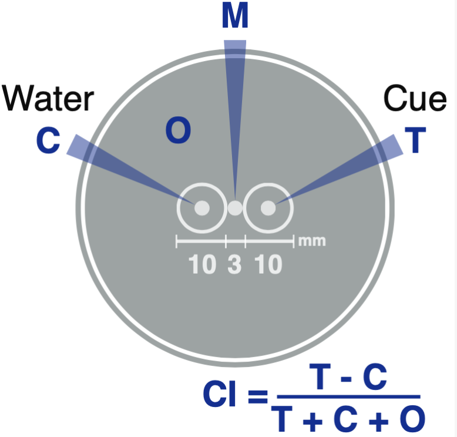

# L3 Filarial Parasite Chemotaxis Assay

## Preparing Chemotaxis Plates

- Make 0.8% (w/v) agarose plates. Microwave to dissolve (mix intermittently). Pour ~10 mL of agarose into each 6 cm plate.

- Once plates are solidified, measure and label the chemotaxis plate like the image below:

## Assay Setup

1. Allow L3/L4 to soak in RPMI+P/S for ~30 min prior to chemotaxis assays to re-sensitize to FBS

2. Place 2 µL of DI H2O in the M-area, and then pick 8-10 L3s/L4s and place in the DI H2O in M-area

3. After L3s are placed, add 3 µl of test compound into the T-zone and 3 µl of DI H2O into the C-zone

4. Place plates in 37°C incubator monitor the L3 migration every 10 min.

5. Once majority of L3 have begun to migrate, count the L3s in each zone/area. This includes counting the L3s that have not left the center.

6. Run each condition in at least triplicates.

7. Calculate the chemotaxis index (CI) for each experiment using the formula found in the plate image above.

8. Record chemotaxis data in an excel spreadsheet and save as a .csv file (example: 20181019.csv). Save file under ZamanianLab ▸ Data ▸ Chemotaxis ▸ Parasite spp.
