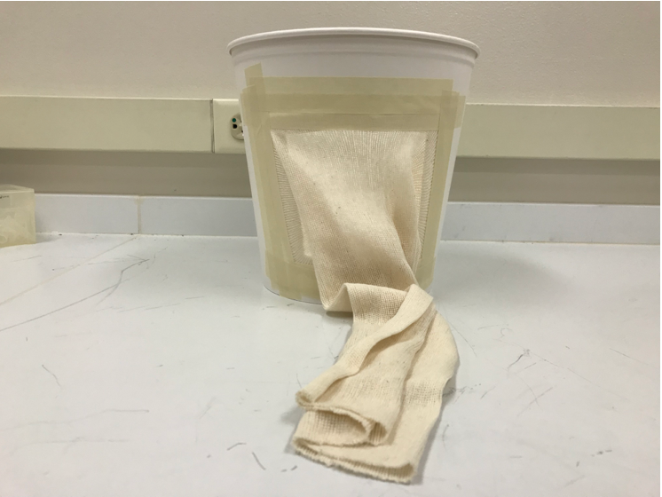
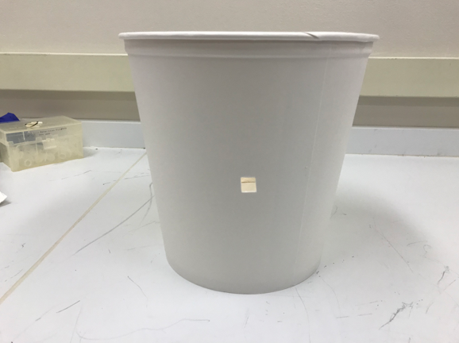
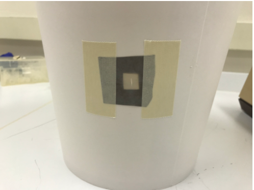
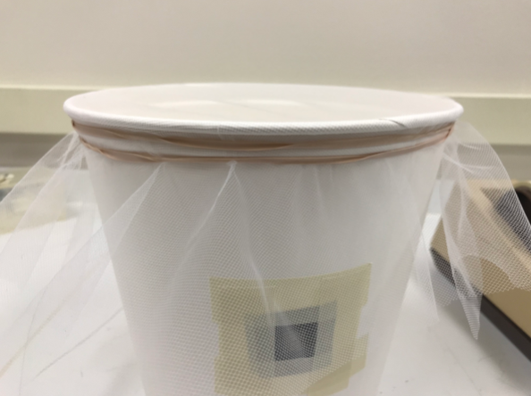
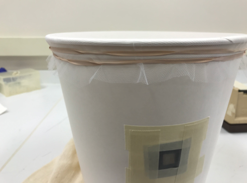
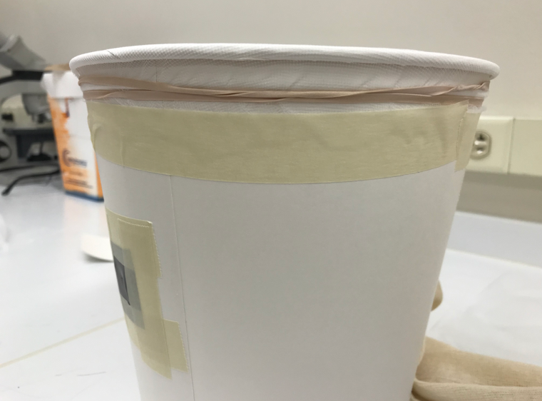

# Mosquito Carton Assembly

## Materials
- 165 oz Solo paper bucket (Cat. 10TR25-J8000)   
- Two rubber bands   
- 30 cm long stockinette (STK1625)  
- Razor Blade  
- 26 cm x 26 cm piece of white mesh (local craft store)  
- Duck masking tape (Cat. 240569)  
- Dental Dam (Cat. H04247)

    

### Carton Assembly
1. Using a razor blade, cut out a 13 cm x 13 cm square on the side of the large carton.

    

2. Stretch one end of the stockinette over the large hole you previously made. Tape around the edges using masking tape. Repeat taping, so that there are two layers of tape holding down stockinette.

    

3. On the opposite side of the hole/stockinette, make a 1 cm x 1 cm square using the razor blade.

    

4. Cut out two, 4 cm x 4 cm squares of Dental Dam

    

5. Fold one square of Dental Dam in half. In the middle of the folded edge, make a slit (~0.5 cm) using the razor blade. Repeat this for the other piece of Dental Dam. Each piece of Dental Dam should have a 1 cm slit in the middle.

6. Take one of the pieces of Dental Dam that you just cut, and place over the small hole you previously made in the carton. Align the slit, so that it is in the middle of the hole. Once in place, place two pieces of tape on two sides of the Dental Dam (sides don’t matter).

    

7. Take the other piece of Dental Dam and place it over the top of the other square. Align like before, but make sure the slit is going in the opposite direction from the one beneath it. The slits should make a cross. Tape down all four sides of this piece of Dental Dam.

    

8. Take a piece of 26 cm x 26 cm white mesh, and place on top of the carton. Align the mesh, so that the bucket is in the center of the mesh. Inspect the mesh, and make sure there are no holes. Secure the mesh around the rim of the carton using two rubber bands (place one rubber band at a time). Avoid crushing the carton. Adjust the mesh to make sure it is pulled tight, and that it is flush with the rim of the carton.

    

9. Trim the excess netting around the circumference of carton.

    

10. Tape down the mesh using masking tape twice. Make sure all the edges of the tape are secured with tape.

    

11. Place the completed carton on the shelves located along southeast wall in lab connected to insectary.
