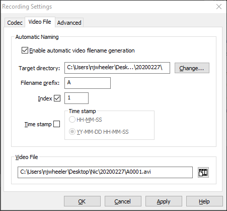
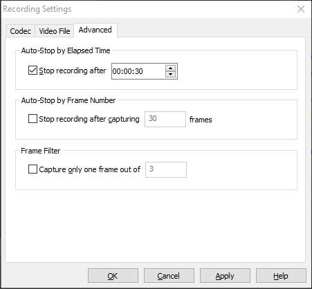
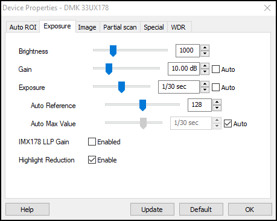

# Motility analysis of parasites and *C. elegans*

Motility of live worms is analyzed with an optical flow algorithm developed by Dr. Nic Wheeler in the Zamanian Lab. The code can be found in a [repository](https://github.com/zamanianlab/BrugiaMotilityAnalysis) in the Zamanian Lab GitHub. Videos can come from a variety of sources, and it is imperative that the proper protocol is used for each recording setup.

## WormViz

The WormViz is primarily used for recording of adult filarial parasites in 24-well plates. An entire plate is recorded at one time, and then separate videos from each well are manually cropped.

1. Plug the Imaging Source camera (DMK 23GP031) into the USB 3.0 port of the computer and open up the IC Capture software. (**NOTE**: the camera will produce heat as long as it is plugged in, so be sure to unplug it immediately after recording is finished.)

2. Adjust the camera on the stand so that the bottom of the camera holder is even with the red mark labeled "24 WP"

3. Open the camera aperture all the allow as much light in as possible. The camera will be focused later.

2. Turn on the red LED power source to the highest setting.

3. In IC Capture, select the camera which should open an image pane and show a new set of toolbars.

    

4. Change the following settings in the top toolbar:

    - Video format = Y800 (1280x960)
    - FPS = 16

5. Click the first button on the third toolbar (red recording icon overlaying a dialog box) to open the recording control dialog:

    

6. Click the icon under "Filename" to open the recording settings dialog:

    

      - For videos of entire plates, deselect the option to "Enable automatic filename generation" .

    - Click "Change..." and select the folder where you want your videos to be saved. In general, they should be saved to a folder on the Desktop with your name, and they should be contained in a folder with the recording date as the title, i.e. `Desktop > Nic > 20200227`.

    - Click the icon under "Video File" and insert a file name with the following structure:
    `Species_Stage_Time-Treatment` i.e. `Bm_AF_1hr-cholinergic`

    - Click "OK" to exit this dialog.

    - In the recording control dialog, click the clock icon:

    

    - Select "Stop recording after" and input the recording duration.

    - Click "OK" to exit the recording settings dialog, but do not exit the recording control dialog.

 7. Click "Device > Properties" to open the following dialog:

    

    - Adjust the following settings:

        - Brightness = 1000
        - Gain = 10.00
        - Exposure = 1/30

    - **NOTE**: some slight modifications of these settings may be necessary once you place the plate on the recording stage; the exposure may need to be decreased (be sure not to increase the exposure time to be higher than the frame rate). It is best to keep the worms in the incubator for as long as possible and minimize the amount of time at room temperature, so it's a good idea to adjust the device properties to sensible defaults prior to placing the plate of worms on the stage.

    - Click "OK" to close the device properties dialog

9. Remove the plate of worms and place the plate on the recording stage.

10. Adjust the camera focus so that the worms are at the highest resolution (it may be useful to increase the zoom on the toolbar to 150-200%)

8. On the top toolbar, decrease the zoom so that you can see the entire field of view in the imaging pane (40% often works best).

11. Adjust the placement of the plate so that the entire plate is in view and well A1 is on the top left of the image.

12. When everything looks good, click the red record icon in the recording control dialog.

<!--
## Zeiss Stemi 508

## ImageXpress

There are a few primary considerations when preparing to record videos:

1. Video size: Generally, files are stored as raw AVI files or with JPEG compression. JPEG compressed videos are much smaller but the compression is lossy (i.e. lower resolution than the raw version), but in our experience this does not significantly hinder analyses. File size is a direct correlation between video format (i.e. 1600x1200) and the number of total frames, which is controlled by the frame rate (frames per second, FPS) and video length. One needs to consider all these factors prior to recording. A good place to start:

    - 1600x1200 pixels
    - 15-30 seconds
    - 16-30 FPS

2.
-->
